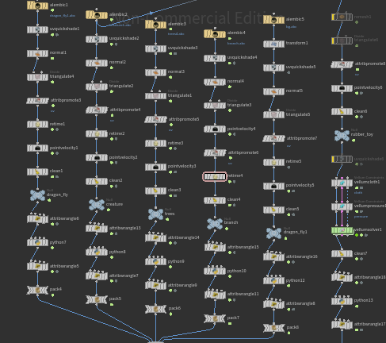
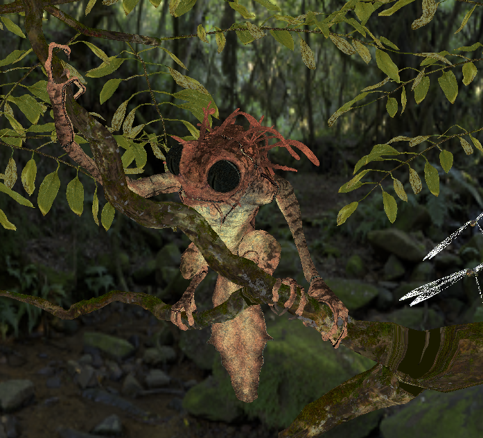
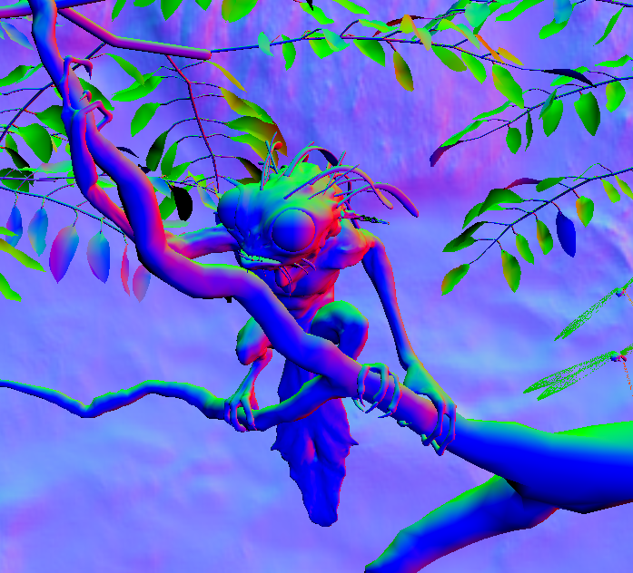
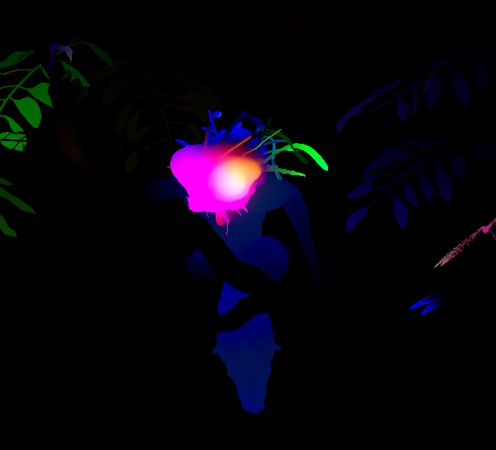
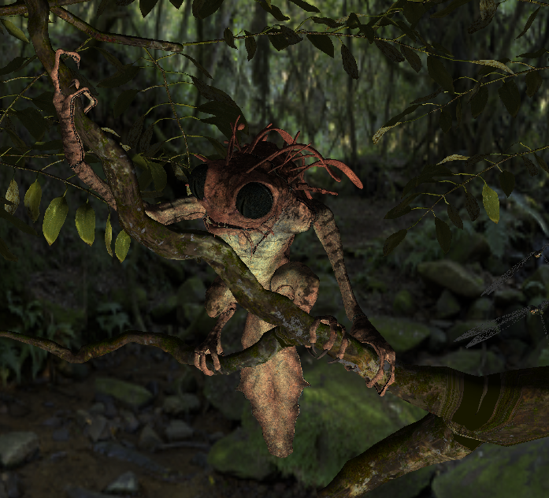
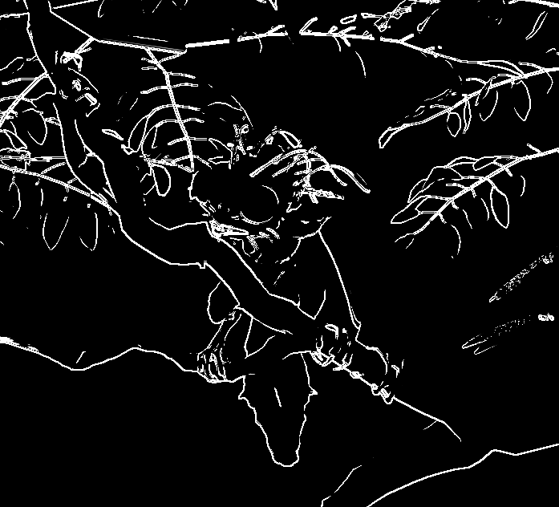
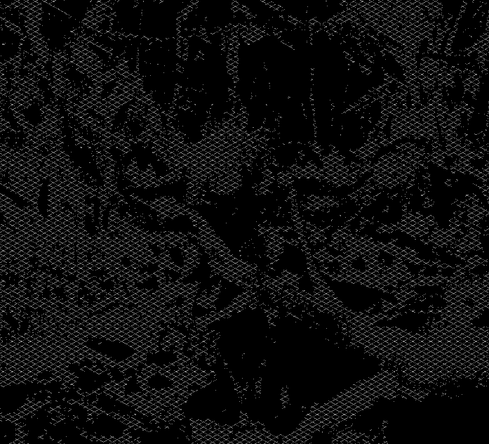
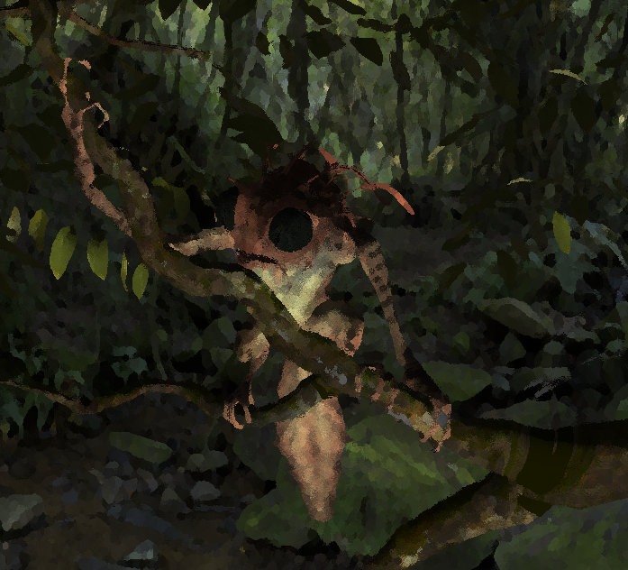
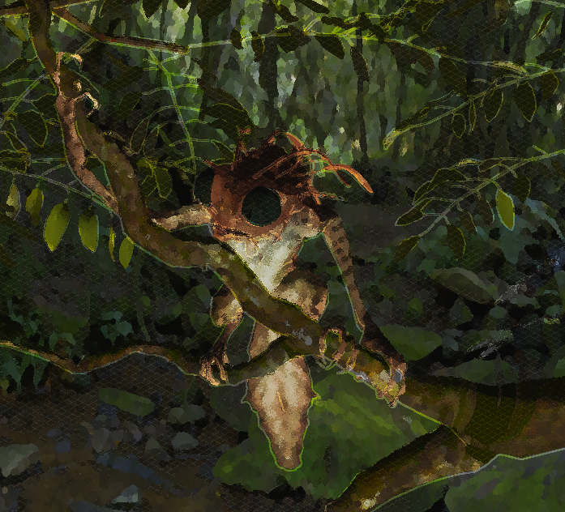

## NPR Pipeline Plugin

  - **G-buffer Pass** ---> (color, normals, velocity, depth)
  - **Subsequent Passes** (Phong, Outline, Hatching, Watercolor, Final) read from G-buffer
- **Dynamic Objects**:
  - For animated meshes, vertex data is updated from `.dat` files each frame
  - Efficient approach avoids re-loading entire geometry
---


### Scene Preparation
- **Starting Point**:
  - Used Blender demo “Tree Creature” scene & another scene I made
  - Reorganized objects, combined UV maps for fewer textures
- **Baking & Exporting**:
  - Baked diffuse colors into textures in Blender
  - Exported to Houdini, triangulated the meshes
  - **Houdini Node Setup**: Exports per-frame data (`.dat` files for positions, normals, velocities, UVs)
- **Scene Data**:
  - `scene.dat` file lists objects, their triangle and point count, and flags for static/animated

---

```
├── scenes
│   ├── creature
│   │   ├── bg
│   │   │   └── frame_0.dat
│   │   │   └── ...
│   │   ├── branch
│   │   │   └── frame_0.dat
│   │   │   └── ...
│   │   ├── creature
│   │   │   └── frame_0.dat
│   │   │   └── ...
│   │   ├── dragonfly
│   │   │   └── frame_0.dat
│   │   │   └── ...
│   │   ├── scene.dat
│   │   └── trees
│   │       └── frame_0.dat
│   │       └── ...
│   └── scene2
│       ├── rubbertoy
│       │   └── frame_0.dat
│       │   └── ...
│       └── scene.dat
├── shaders
│   ├── NPR
│   │   ├── debug.frag
│   │   ├── displacement_pass.frag
│   │   ├── final_pass.frag
│   │   ├── hatching_pass.frag
│   │   ├── outline_pass.frag
│   │   ├── phong_pass.frag
│   │   ├── quad.vert
│   │   └── watercolor_pass.frag
│   └── Objects
│       ├── bg.frag
│       ├── bg.vert
│       ├── branch.frag
│       ├── branch.vert
│       ├── creature.frag
│       ├── creature.vert
│       ├── dragonfly.frag
│       ├── dragonfly.vert
│       ├── rubbertoy.frag
│       ├── rubbertoy.vert
│       ├── trees.frag
│       └── trees.vert
└── textures
    ├── bg_color.png
    ├── bg_normal.png
    ├── branch_color.png
    ...

// scene.dat
5
dragonfly 8616 16032 animated
creature 36979 73698 animated
trees 72248 127204 static
branch 2702 5400 animated
bg 4 2 static
```

```
/**
 * Subdata update for positions (3 floats), normals (3 floats), uvs (2 floats),
 * and optionally velocities (3 floats).
 */
void Object::updateBuffers(const std::vector<float>& positions,
                           const std::vector<float>& normals,
                           const std::vector<float>& uvs,
                           const std::vector<float>& velocities)
{
    size_t nPos = positions.size();
    size_t nNor = normals.size();
    size_t nUV  = uvs.size();
    size_t nVel = velocities.size();

    try {
        mesh_->bufferVertexSubData(0, positions.data(), nPos * sizeof(float), 0);
    } catch (const glowl::MeshException& e) {
        std::cerr << "[Object::updateBuffers] " << name_
                  << " pos subdata error: " << e.what() << std::endl;
    }
... 
}
```

### Multi-Pass Rendering

| **Pass**         | **Purpose**                                                                       | **Input**                                         | **Output**                             |
|------------------|-----------------------------------------------------------------------------------|---------------------------------------------------|-------------------------------------------------|
| **1. G-buffer**  | Collect geometry data (base color, normals, velocity, depth) into multiple attachments | Scene geometry and baked textures       |    |
| **2. Phong**     | Basic Phong lighting to get a lit color pass                                      | G-buffer (base color, normals, depth)            |  |
| **3. Outline**   | Edge detection using Sobel on normals, outline thickness                          | Normals                      |  |
| **4. Hatching**  | Diagonal cross-hatching pattern in dark areas, controlled by a uniform            | Phong pass             |  |
| **5. Watercolor**| Painterly or noise-based watercolor effect                                        | Phong pass              |  |
| **6. Final**     | Combines Outline, Hatching, Watercolor, toon quantization & grayscale        | Outline, Hatching, Watercolor passes             |  |

---

### UI Controls
- **Playback**: Play, Pause, Stop; adjustable FPS
- **Camera**: Orbit controls; adjustable FoV, clipping planes
- **Lighting**: Editable direction (longitude/latitude), distance
- **Effects**:
  - Outline thickness
  - Hatching intensity
  - Watercolor mode (simple/painterly), radius, strength
  - Toon quantization (bands, grayscale option)
- **Debug View**: Switch among G-buffer, Phong, Outline, etc.
